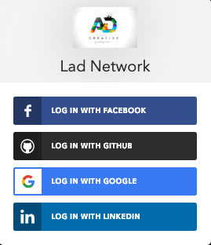
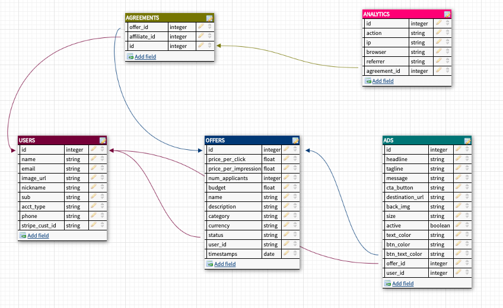

 # 🔥 labs11-adNetwork-BE 🔥

##### Backend URL : https://lad-network.herokuapp.com

### Project Management
- [TrelloV1](https://trello.com/b/QyrA6PgD/labs11-non-creepy-ad-network) 🌍
- [TrelloV2](https://trello.com/b/cXZ3clQ7/lad-network) 🌍


## Table of Contents
 - [Summary Table of API Endpoints](#summary-table-of-api-endpoints)
   - [User](#user)
   - [Offers](#offers)
   - [Ads](#ads)
   - [Analytics](#analytics)
   


### Summary Table of API Endpoints
| Type   | Endpoints           | Description                      |
| ------ | ------------------- | -------------------------------- |
| POST   | /api/auth/register  | Register User using Auth0        |
| GET    | /api/api/users      | Get User Info                    |
| PUT    | /api/api/users/:id  | Update User                      |
| DELETE | /api/api/users      | Delete User Account              |
| GET    | /api/offers         | Get offers                       |
| GET    | /api/offers/:id     | Get offers by id                 |
| POST   | /api/offers         | Add offers                       |
| PUT    | /api/offers/:id     | Update Offer                     |
| DELETE | /api/offers/:id     | Delete Offer                     |
| GET    | /api/ads            | get all ads                      |
| GET    | /api/ads/:id        | Get ads by id                    |
| POST   | /api/ads            | Post an ads                      |
| PUT    | /api/ads/:id        | update ads by id                 |
| DELETE | /api/ads/:id        | Delete an ads                    |
| GET    | /api/ads/offers/:id | get offers by id                 |
| GET    | /api/ads/allads/:id | get accepted ads by affiliate_id |
| GET    | /api/analytics      | GET analytics                    |
| GET    | /api/analytics/:id  | Get analytics by id              |
| POST   | /api/analytics      | POST analytics                   |


#### Register and Login Options



#### User

`GET, PUT, DELETE 200 success ✅ Private`
```
{
    "id": 4,
    "name": "John Benedict Miranda",
    "email": "jbmiranda22796@gmail.com",
    "image_url": "https://media.licdn.com/dms/image/C4E03AQHWn1xyl8YaSA/profile-displayphoto-shrink_100_100/0?e=1560384000&v=beta&t=rSgo6M7-lDWtq772krO-EBB8gskFCGRlecEbVqQEJDU",
    "nickname": "jbmiranda22796",
    "sub": "linkedin|5gWW_xGV9g",
    "acct_type": "affiliate",
    "phone": null,
    "amount": 0,
    "show_tour": true,
    "stripe_cust_id": null,
    "stripe_payout_id": null,
    "stripe_balance": 0,
    "offers": 0,
    "ads": 0,
    "agreements": 1
}
```


#### Offers 
`GET, DELETE, PUT 200 success ✅`
```
 [
    {
        "id": 1,
        "price_per_click": 0.5,
        "price_per_impression": 0.02,
        "num_applicants": 0,
        "budget": 150,
        "name": "Hamza's Offer",
        "description": "Hamza's Description",
        "category": "Finance",
        "currency": "USD",
        "status": true,
        "user_id": 2,
        "created_at": "2019-04-12T22:26:12.853Z",
        "updated_at": "2019-04-12T22:26:12.853Z",
        "active": false,
        "accepted": false,
        "agreement_id": null
    }
  ]
```
`500 error ❌ `
```
  {
    "message": {
        "message": "Invalid token specified: Unexpected token \u0007 in JSON at position 278"
    }
}
```

#### Ads 
`GET, DELETE, PUT 200 success ✅`
```
[
    {
        "id": 1,
        "name": "HELLO",
        "destination_url": "",
        "active": true,
        "size": "horizontal_banner",
        "offer_id": 1,
        "user_id": 2,
        "image": "https://res.cloudinary.com/dypcywjue/image/upload/v1555108065/blbbqzuvg5m7hdkg2hhv.png",
        "created_at": "2019-04-12T22:27:45.368Z",
        "updated_at": "2019-04-12T22:27:45.368Z"
    }
  ]
```

#### Analytics 
`GET, DELETE, PUT 200 success ✅`
```
{
    "clicks": [],
    "impressions": [],
    "conversions": [],
    "actionCount": {
        "impressions": 0,
        "clicks": 0,
        "conversions": 0
    },
    "browserCount": {
        "chrome": 0,
        "safari": 0,
        "edge": 0,
        "firefox": 0,
        "other": 0
    },
    "cities": [],
    "growth": {
        "clicks": null,
        "impressions": null,
        "conversions": null
    },
    "offersRanking": [
        {
            "id": 1,
            "price_per_click": 0.5,
            "price_per_impression": 0.02,
            "num_applicants": 0,
            "budget": 150,
            "name": "Hamza's Offer",
            "description": "Hamza's Description",
            "category": "Finance",
            "currency": "USD",
            "status": true,
            "user_id": 2,
            "created_at": "2019-04-12T22:26:12.853Z",
            "updated_at": "2019-04-12T22:26:12.853Z",
            "ctr": 100
        }
    ],
    "devices": []
}
```


#### Private Route middleware
`500 error ❌`
```
{
    "message": "You need to passed Headers !"
}
```

#### ️DB Schema



### Authors 
- John Benedict Miranda [Github](https://github.com/john2796) , [linkedin](https://www.linkedin.com/in/john-benedict-miranda-7b2357180/)
- Hamza Elkhoudiri [Github](https://github.com/elkhoudh) , [linkedin](https://www.linkedin.com/in/hamza-elkhoudiri-a606aa162/)
- Max McFerren [Github](https://github.com/mcferrenm) , [linkedin](https://www.linkedin.com/in/max-mcferren-423b75115/)
- Kieran Vieira [Github](https://github.com/KieranVieira) , [linkedin](https://www.linkedin.com/in/kieran-vieira/)
- Jordan Marsaw [Github](https://github.com/blokboy) 


